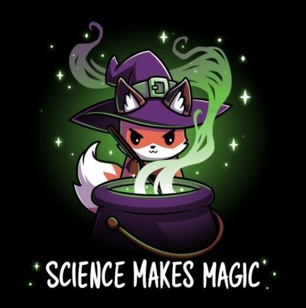

## Hi there 👋 , I'm Lenat

### About me 💫

🎓 I'm an AI and Data Science major with a deep curiosity for solving real-world problems using intelligent systems.  
💡 I love exploring challenging problems and designing creative solutions.

### Want to know what I am feeling today? 💬
<!--START_SECTION:update_image-->

<!--END_SECTION:update_image-->

### My Hobbies include 🎵
* Gaming : Casual gamer here! I enjoy all kinds of games except competitive ones — that's just not my vibe, nah ha. Lately, I've been hooked on the factory/automation genre.
* Music  : I'm a huge metalhead. Metal music flows through my veins — nothing beats the raw energy and adrenaline it brings.

If you ever want to chat about games or metal, I’m always up for it! Feel free to reach out. 🤘

### What I'm passionate about 🌱

🤖 Artificial Intelligence & Machine Learning  
📊 Data Science & Predictive Modeling  
🧠 Problem Solving & Research  
🕹️ Game Development (exploring this as a creative outlet!)  
🌐 Web Development (not my core area, but I enjoy building cool interfaces)

### Tech Stack 💻

### Github Stats 📊

### 📫 Let's Connect!
Feel free to connect or reach out if you're interested in collaborating or just want to talk.
How to reach me: lenatthomas16@gmail.com

### Fun fact ⚡

What does the fox say....? 

It laughs and its soothing ✨✨✨🫠

Why fox you ask? Well 

